# Git、GitHubを使う

## 1.VSCodeを使ってGithubのデータを操作する準備をしよう

VSCodeと[Github](../beginners/git#github)でデータを操作する方法はいくつかありますが、一番簡単でコマンドを打たない方法を教えます。最初はこれだけ覚えておけば大丈夫だと思います

### 1-1.Githubでリモートリポジトリを作ろう

Githubにリモート[リポジトリ](../beginners/git#リポジトリ)を作成します
GitやGithubでは操作しているフォルダのことをリポジトリといいます。リモートリポジトリはサーバーにあるリポジトリ、ローカルリポジトリはPCにあるリポジトリのことを言います

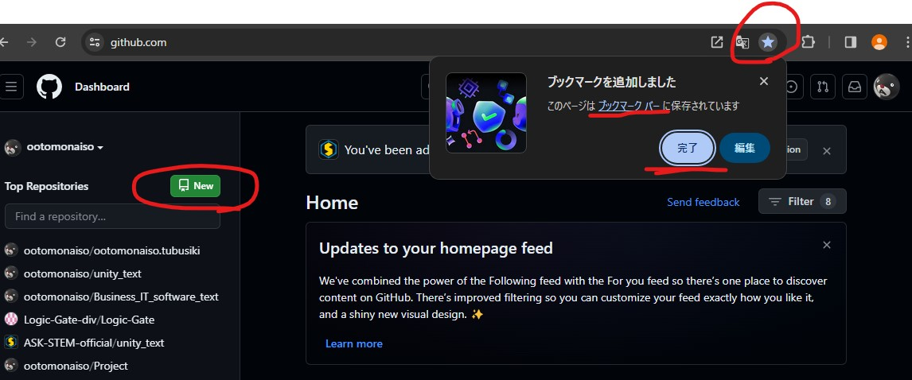

Githubのページにアクセスできたらとりあえずこのページをブックマークしておきましょう。後から開きやすくなります
ブックマーク出来たら左側にあるNewと書かれた緑のボタンを押しましょう

### 1-2.リモートリポジトリをの設定して作成

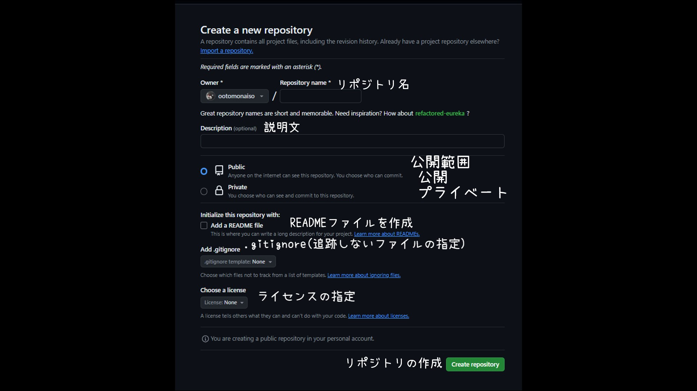

リポジトリ名を入れてください。今回はdemoとしました。日本語使えません。
説明文は入れなくても大丈夫です。公開範囲はPublicにすると誰でも見れるようになります。Privateにすると基本的には作成したユーザーのみアクセスができるます。アクセスユーザーを追加することによってその人も閲覧・編集ができるようになります。
readmeファイルはGithubでリポジトリを開くと保存されているファイルの下に表示されるようになります。
[.gitignore](../beginners/git#gitignore)とはgitで管理しないファイルやフォルダを指定できる設定ファイルです。後から作成もできます。
ライセンスについてですが特に気にする必要はないかと思います。

設定を確認したら右下の緑のリポジトリ作成ボタンを押してください。

### 1-3.VSCodeを使って作成したリモートリポジトリをクローンする

ここからはVSCodeでの操作に移ります

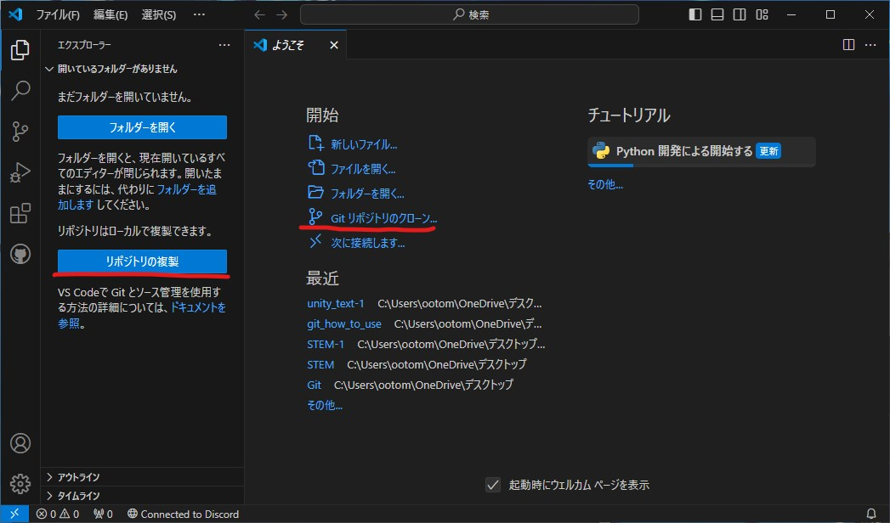

左側のリポジトリの複製、もしくは右側のGitリポジトリの[クローン](../beginners/git#クローンclone)を押してください。

Githubから複製を選択

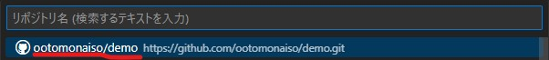

クローンしたいリポジトリを選んでください。
そうするとエクスプローラーが開くのでフォルダの複製先を選んでください。ソフトウェアによっては日本語名の入ったファイルパスを参照できない場合があります。特にプログラミング系。そういう場合はCドライブ直下に保存すれば大丈夫です。

今回は面倒なのでデスクトップにフォルダを作ります。今回はフォルダにGithub_Projectと付けました。別にどんな名前でも大丈夫です。

そうすると複製が開始されます。そのあと開くと複製したリポジトリの名前が付いたフォルダが開きます。今回は複製元のリポジトリに何も保存していなかったので

## 2.変更したデータをコミットしよう

データを新しく作成したから保存をしたり、大規模に改修をする前にバックアップを取ったりと、クローンしたリポジトリにデータをアップロードするのを[コミット](../beginners/git#コミット)といいます。

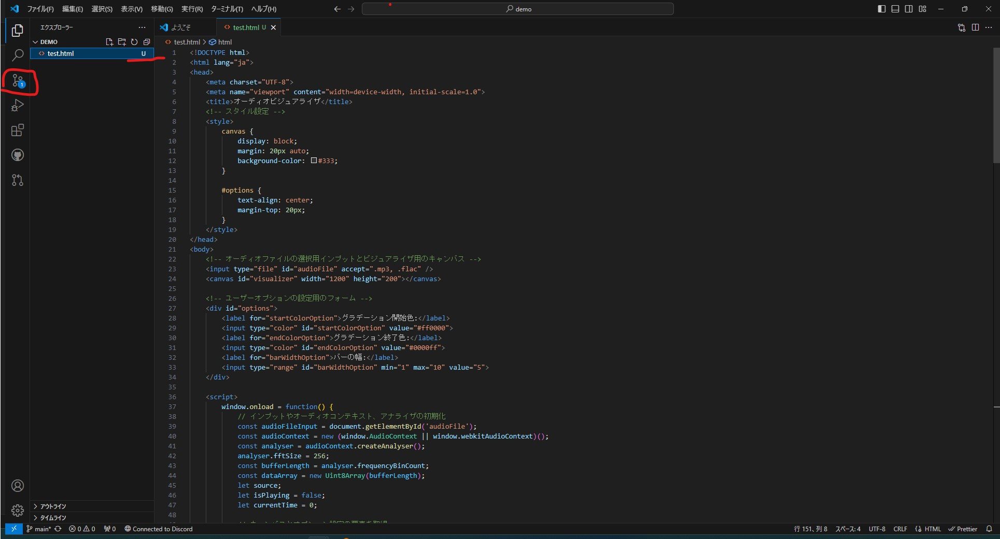

変更点があるとこのようにファイル名の色が変わって、左側のソース管理タブに変更したファイルの数がついた丸いアイコンが出てきます。
これをクリックしてみましょう

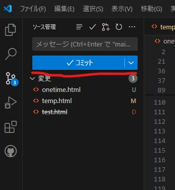

そうするとこのように変更されたファイルの一覧が出てきます。この場合test.htmlというファイルが新規作成されたという意味となります

Uと緑色の文字で書かれているのはファイルの新規作成です。Mとオレンジ色で書かれているのはファイルの更新です。Dと赤字で書かれているのは削除されたファイルということです。
このアイコンはGithubのリポジトリと比べてどう変更されたかで表示されます。
ではこの変更をGithubにあるリモートリポジトリにコミットしましょう。

コミットと書かれた青いボタンの上にコミットメッセージを入力するテキストボックスが作成されます。
ここにどういうところを変更したのかなどの情報を書き込みましょう。ここに何も入れていない場合コミットできません。

もしやらかした場合COMMIT_EDITMSGを閉じれば元の世界に帰ってこれます。

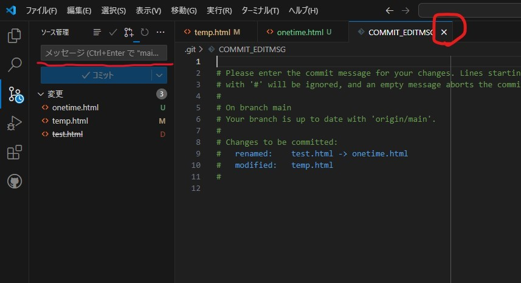

ちゃんとテキストボックスにコミットメッセージを入れてコミットしていきましょう。コミットボタンを押してください。

ローカルリポジトリで作業している場合はそのまま完了します。
リモートリポジトリ、つまりGithubにデータを上げようとしている場合、コミットボタンがあったところに変更の同期というボタンが置いてあると思います。これを押して送信してください。

## 3.過去のコミットを参照しよう

gitはファイルの変更履歴を取ってくれる優れものです。変更点を確認して、戻したりできます。

### 3-1.エクスプローラーでタイムラインを開こう

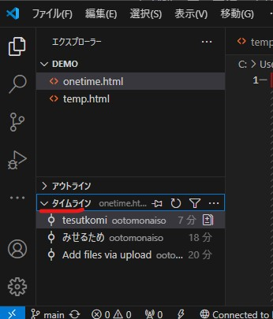

エクスプローラーの下の方に、現在開いて編集しているファイルの変更履歴を見れるタイムラインというタブがあります。押すと展開してローカルリポジトリにコミットした変更履歴が表示されます。

コミットメッセージを見て見比べたい[バージョン](../beginners/git#バージョン)をクリックしてみましょう

そうするとこのように変更された部分が色分けしてみることができます
横に並んで閲覧しているときは左側、小さいビューで1つの画面で見ているときは上が古いバージョンになっています

### 3-2.欲しい部分をコピペする

本来はちゃんとgitのコマンドを打つべきですが、VSCodeはコードエディタなのでさっきのような画面の状態でも、テキストのコピーが普通にできます。なのでほしい部分を選択してコピーすることで元の状態に戻すことが可能です

拡張機能のGit Graphというgitでのファイルの履歴を視覚化して残してくれる優秀なツールがあります。

## 4.プルをしてGithubのローカルリポジトリとバージョンを合わせる

他のデバイスで編集したり、Githubで直接編集した場合など、Github側のバージョンと手元のローカルリポジトリのバージョンを合わせる必要があります。

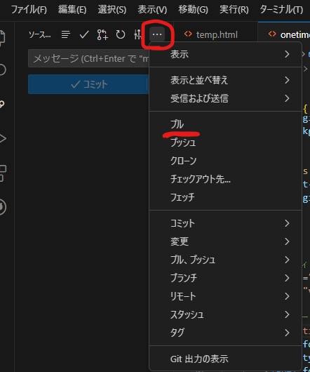

バージョン管理画面を開いて、三点マークを押すと[プル](../beginners/git#プルpull)するメニューが出てきます。これを押すとGithub側のバージョンと合わせることができます

## 5.ブランチを作ってプルリクエストを出そう

プルリクエストはある[ブランチ](../beginners/git#ブランチbranch)から別のブランチに変更を統合してくれないかなーって出すリクエストです。
学校でやるならmainブランチから開発する機能や人によってブランチを分けて、ちゃんと動作が確認出来たら作業をしてたブランチからmainブランチにプルリクエストを出すのがほとんどだと思います。

### 5-1.ブランチを作ろう

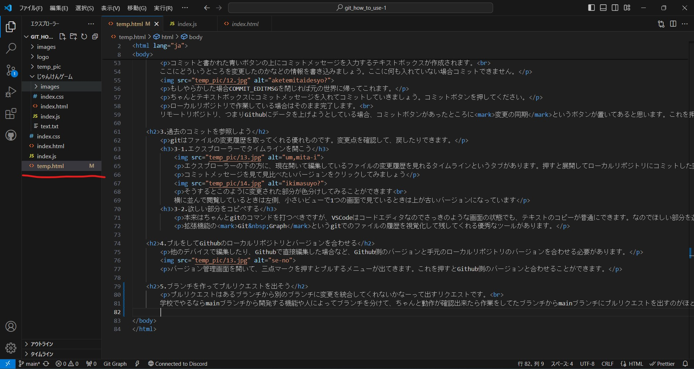

ちょっと例を用いて説明します。これはこのページの作成風景です。このページは業務用ITソフトウェア班とWeb班で編集しています。そのためもしかしたら同じ場所を編集してしまいバージョンの競合が発生するかもしれません。
基本的に複数人で作業したり、mainブランチを更新すると動作しない可能性があるなどの問題がある場合に使います。

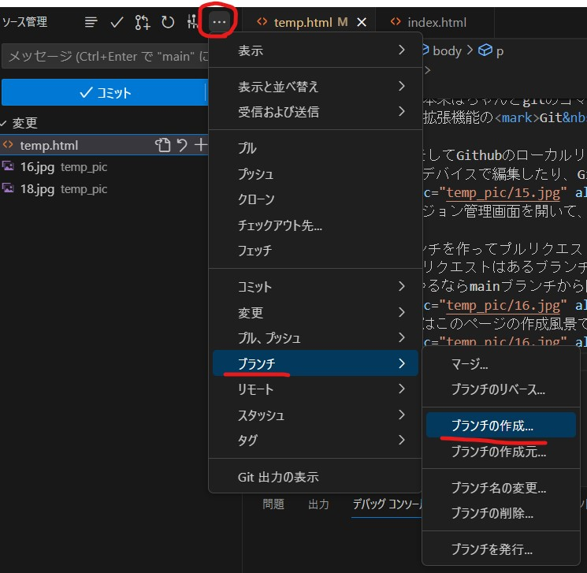

ソース管理画面を開いてブランチを作りましょうソース管理のコミットメッセージボックス上のドロップダウンメニューを開きます。ブランチを選択してブランチの作成を選択します。

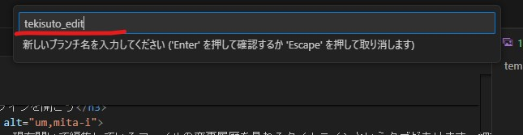

名前を入力する画面が出てきます。何してるかわかりやすくするために今回はtekisuto_editと付けてみました。何してるかわかるなら1とか2とかでも大丈夫だと思います。

### 5-2.プルリクエストを出そう

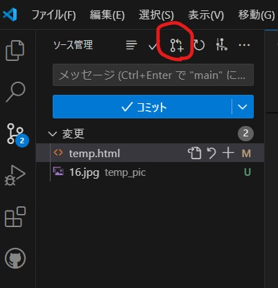

バージョン管理画面の右上に[プルリクエスト](../beginners/git#プルリクエストpullrequest)のアイコンがあります。こいつをクリックしましょう。

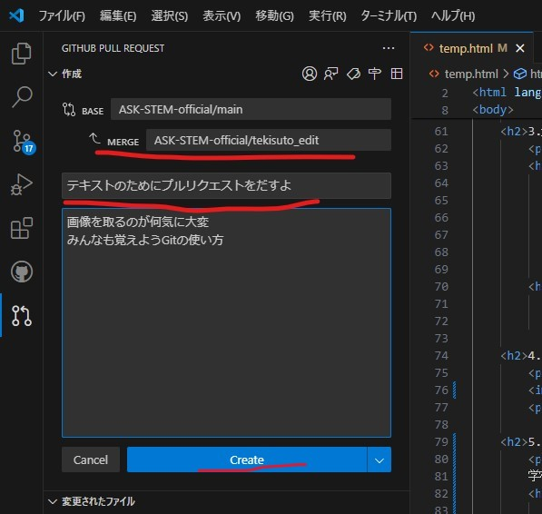

そうするとこのように作成画面が出てきます。
BASEはプルリクエストの統合先のことです。[MERGE](../beginners/git#マージmerge)はプルリクエストの統合元になります。
その下はプルリクエストのタイトルです。どういう変更をしたか書いておきましょう。その下はメモ書きみたいなものです。
青いCREATEボタンをクリックして出力してください

BranchがGithub側にない場合はBranchを発行するか聞かれます。Branchを発行しないとデータを上げる先がなくなるので作成しておきましょう。 Github側のブランチに何もデータがない場合、データを入れるかどうか聞かれます。

プルリクエストを出すとGithub側のリポジトリにプルリクエストが発行されます。問題なければコミットして[マージ](../beginners/git#マージmerge)しましょう